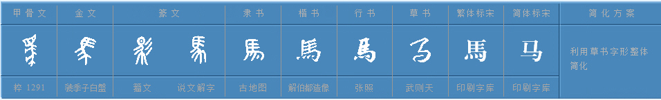
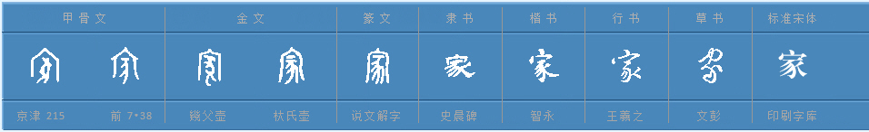

# Chinese characters

This blog originated from my first cambly class, my English teacher, Stephan asks me "What are the differences between [**mandarin**](https://en.wikipedia.org/wiki/Mandarin_Chinese) with other dialects?".

I have to admit that it is a complex and huge problem. As we can see from the picture below, mandarin occupies most of the area. The things I should emphasize that there are many different accents for mandarin. There may be great differences between these accents, for me, a native Chinese speaker, may not understand it.

*Note: The figure above is quoted from https://en.wikipedia.org/wiki/List_of_varieties_of_Chinese*

## Why are so many dialects in China?

As we all know, China has the third largest territory in the world. Large territory means abundant topography. The figure below is the china topographic map, we can see that there are so many mountains around China, mountains can block the communications between people. Especially, the Chinese language has lasted for thousands of years, that means these languages may have evolved one thousand years independently. 

Especially, in the south of China, there are endless hills, people who are tens of kilometers apart cannot communicate normally. But I have to say that the southern Chinese are the most adventurous group because of the poor natural resources. You can visit [History of Chinese Americans](https://en.wikipedia.org/wiki/History_of_Chinese_Americans) in the wiki, they almost came from the south of China. Since they speak Cantonese, Cantonese become the most popular Chinese language in West. But trust me, Cantonese speakers account for less than one-tenth.

 

So with so many dialects, why can China last two thousand years without splitting up? IMO, Qin Shi Huang is the person we should thank most.

## [Who is Qin Shi Huang](https://en.wikipedia.org/wiki/Qin_Shi_Huang)
Qin Shi Huang is the first emperor in China, lived from 259 B.C. to 210 B.C. He was slightly later than Alexander the Greate in world history.

He was called the greatest emperor in China, not only because he unified the seven countries in [Warring States period](), but also because he unified weights, measures, and words.

*Note: The figure above is quoted from the https://en.wikipedia.org/wiki/Warring_States_period#/media/File:EN-WarringStatesAll260BCE.jpg.*

Before the unification, there are several words, although they are all similar, in some extent, ununified words indeed hinder the communications.

In the above figure, the first line is 鱼，i.e. fish. According to the shape of the first word in the first line,  we can easily recognize this Chinese character as a fish. 

### Germanische Sprachen

Although I'm not a linguist, IMHO, the reason why the languages under Germanische Sprachen family are different may be that there is no unification of words. In contrast, because Qin Shi Huang unified the Chinese characters, China as a whole can communicate smoothly.

*Note: If anyone who familiar relevant information, please help me improve this section.*

# Chinese character
Chinese characters are the few hieroglyphs [haɪə'rəɡlɪfs] still in use. There are some hieroglyphs, like [Egyptian hieroglyphs](https://en.wikipedia.org/wiki/Egyptian_hieroglyphs), are not using anymore. Egyptian hieroglyphs will look more like a picture than oracle bone script. There may be many reasons for the loss of Egyptian hieroglyphs, may be invasion or not efficiency, but it is a another story.

*Note: The above figure is quoted from https://en.wikipedia.org/wiki/File:Egypt_Hieroglyphe4.jpg.*

The oldest Chinese characters are called oracle bone inscriptions because these characters are carved on tortoise shells. Oracle bone inscriptions are not necessarily carved on tortoise shells, it's just the characters on tortoise shells have been passed down.

However in the evolve Chinese characters, they gradually lost the meaning of the original object. Of course, for the characters regular shapes is easy to write.

## [Oracle bone inscriptions](https://en.wikipedia.org/wiki/Oracle)
In this section, I will explain several ancient Chinese characters to illustrate the formation of Chinese characters. I think 凹 and 凸 are the two most representive chinese characters. **凹** means concave, **凸** means convex.

Not like [Egyptian hieroglyphs](https://en.wikipedia.org/wiki/Egyptian_hieroglyphs), Chinese characters are very abstract and mostly use simple lines to describe things.

### Action

#### Pee
The chart below shows the evolution of the word `pee` with the development of the times. On the left is the oldest Chinese character. It is so abstracted, right?

#### Shit
Obvious, the leftmost Chinese character means `shit`. These two Chinese characters can surely be recognized by the majority of people in the world.

#### Fly

The Chinese character `fly` comes from the actions when birds flying. The leftmost charachter in the follow ing figure is the oldest Chinese character means fly.

#### Born

#### 

### Organ

#### Ear

The leftmost character in the figure below means ear, yea, we can barely regard it as an ear according to its shape.

#### Heart

### Money

The most interesting fact that the Chinese characters related to the meaning of money all contain 贝. 贝 means shell in the sea, because the center of Chinese civilization is far from the sea, so shells are rare, so they are used as money. 

#### Loan

The leftmost character in the following figure means `loan`, the left part means a person, the right part means a shell. So  a person giving a shell to you means he will give you a loan.

### Animal

#### Snake
The leftmost character means `snake`, it's simple but expressive. 

#### Horse

The leftmost character means `horse`, it has big head and there is hair on the neck.

#### Fish

#### Sheep

The character refer to the sheep extract the main features of `sheep`, the sheep born。

### Nature

#### Mountain

The leftmost character in the following figure means `mountain`.

#### Tree

#### Sky

We can see the character refer to the `sky` is formed by a person and something above it. 口 means the space above a person.

### Abstract concepts

Except the characters that used to represent the reality object, there are characters that used to represent the concepts.

Like tree, the corresponding character is as below.

I have to say the leftmost character in the above figure is too abstract like a painting works by three old children. Although the character is abstract, we still have objects to imitate to create the new character.

How about concepts? Without real things to imitate, we have to find another to represent them.
#### beautiful
The leftmost character in the figure below represent `beautiful`, it is a person wearing decorations, maybe sheep born.

#### Endure(Tolerate)
The Chinese character corresponding `endure` is 忍. The upper half part is a knife 刃, the lower part is a heart 心. That means when we are in a dangerous situation similar to when someone else holds a knife against your heart, we have to tolerate to get through this difficult period.

By the way, in traditional east asia home, the house owner probably hung the chinese character 忍  as a decoration. Yea, east asia advocate `edure`!

#### Light
How do we create a character to represent `light`? Light has no specific shape but in the acient age, the most natural  source of light is sun and moon. So the Chinese character about `light` is formed by sun and moon. The leftmost character in the below figure has two parts, the left half part is the sun 日, the right half part is the moon 月. We can recognize them from their shape.

So we can see, the Chinese characters about concepts are inspired by real things. We can use several characters refer to the real objects to form the character.

#### Home 

The character represents `home` has two parts, the outer layer is a house and the inner layer is a pig. If a pig is kept in the house to show that people have settled down, we can call it home.

The figure below contains a series of Chinese characters meaning `pig`.

#### Above and below

The figure below is a series of Chinese characters about `above` or `up`. Since the shape of this character is similar to Chinese characters 二, means two, so it became complex in the process of evolution.

The figure below means `down` or `below`, it has a shorter line than the upper one.

#### Woman

The figure below is a series of Chinese characters meaning `woman`,  the leftmost character refers to people squatting down to do handwork, i.e. woman.

#### Man

Given that the Chinese character refer to `woman` is a person squatting down to do the handwork, we infer that the Chinese character refer to `man` should describe a person to do the hard work. 

The figure below is a series of Chinese characters meaning `man`, it has two parts, the one part is a farm, the other part is power 力. So the person works hard on a farm is the man.

#### Mother

How do we design the character meaning mother? First of all, the mother must be female, and the biggest difference between parents in caring for babies is that mothers need to breast-feed. So the Chinese characters meaning `mother` is a Chinese character plus the emphasis on breasts.

### Ink wash painting

From several Chinese characters above, we can see that Chinese character is very abstract, it does not emphasize similarity. This is similar to Chinese ink wash painting, focusing on the refinement of key features.

### Simplified Chinese character

In the above figures, the oldest Chinese characters are on the left. We can find a fact that the Chinese characters become more and more regular. However, lost the original meanings at the same time.

I have to admit that the hieroglyphics have low efficiency. So Chinese characters have become more and more concise. There are two categories about Chinese characters, the simplified form, and the complex form.

#### Turtle
The leftmost character in the figure below is the oldest Chinese character `turtle`, the rightmost character is the simplified character used in mainland of China, the character next to it is complex form. i.e. traditional form mainly used in HongKong and TaiWan.

If we use the complex form Chinese characters write an article about a turtle, it will dive me crazy.

The debate about should we use the complex form or simplified form has no conclusion for now.

### English words
The English words do not have this issue, the most frequency word is the shortest one. Because the evolution of English words  are not bound by shape.

IMHO, I think this phenominen is related to the information theory. In the information theory, things with the highest possiblity should be represented by the least bits.

We can see, the words that used to represent the daily objects have a short length. Like `I`, `he`, `she`, `dog`, `pig`, `cat`.

And there is a phenominon that `tech` used more and more frequently. The original word of `tech` is `technology`. Along with the technology become more and more popular, there is a need to make the word shorter.

## Why there are no specify word to represent older brother and younger brother in English?
In Chinese culture, rules and etiquette [ˈetɪket]  are very important, so there is a need to distinguish them, like the father of father, the father of mother, the older uncle than your father and younger uncle than your father, they all have different names.
