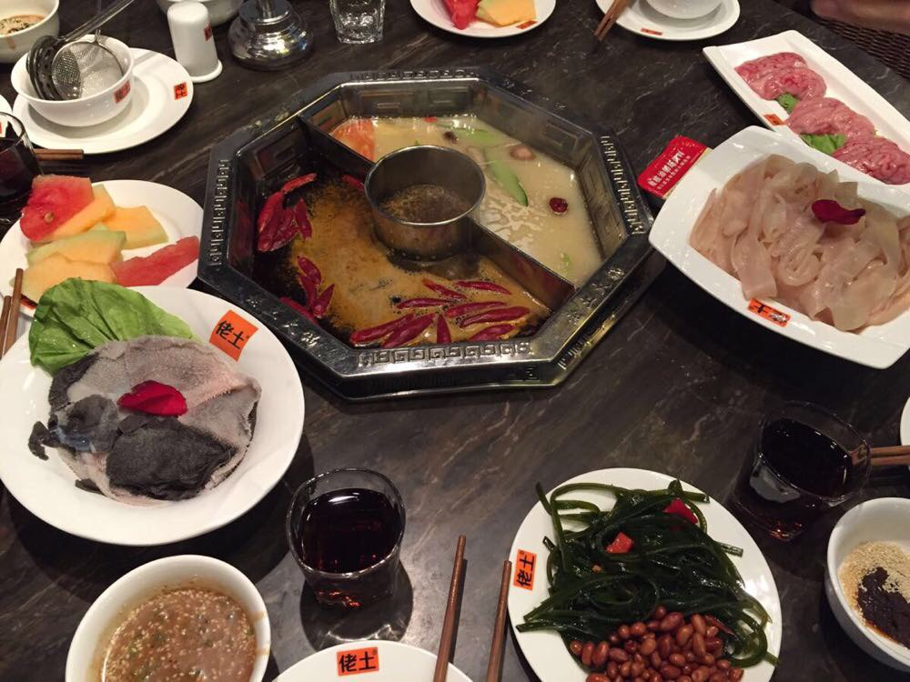

# Chinese Eating Habits

Chinese catering culture has a long history, I'm proud of it but it is just because China has a superior geographical and climatic condition. So today I don't mean to publicize the catering culture. With the development of China, I must have a clean mind about the good side about China and the bad side of China.

The figure below is the ancient noodles discovered in China in 2005. The noodles were cooked 4000 years ago.

## Hotspot

The Sichuan Hotspot or the Chongqing Hotspot are popular in China, they have a spicy flavor. And they are also famous in the world.

The figure below is the typical hotspot in China, it has two kinds of soup, a spicy one and not a spicy one. There is fire below the spot, so the soup keeps boiling. People put the food material into the soup, it is suitable in winter, because make you warm and dispels the cold.

Thre are two typical features about the hotspot, the spicy flavor, and the animal viscera [ˈvɪsərə] . So I'm going to explain why. The area enclosed in red circles is the Sichuan province and Chongqing province, the climate is humid. People believe spicy food can againt the humid climate. However I don't believe it.

The second feature about the hotpot is that people love the animal viscera[ˈvɪsərə] . Because Chongqing is a port on the Yangtze Rive, there are so many poor hamal [hə'mɑ:l] , they can't afford the best part meat of the animial, so they try to expore the  animal viscera, like `bovine blood vessels`, `Duck intestine`, `pig brain`, animal stomach, animal heart. They were surprised to find that the food was delicious.

## Traditional Chinese medical science

There are several weird food in traditional chinese medical science. They think the the tiger bone, snake or child urine [ˈjʊərɪn] can cure disease.

The figure below is snakes in the liquor, people think it will make them stronger.

They think the animal penis can improve their sexual ability. The figure below is the donkey penis, it seems delicious, right?

 

## Cantonese cuisine[kwɪˈzi:n]

The majority of Chinese actually don't eat these weird food, but the Cantonese are the people who like eating these strange food most. We believe the source of SARS is the Cantonese food.

> Severe acute respiratory syndrome (SARS) is a viral respiratory disease of zoonotic origin caused by the *SARS coronavirus* (*SARS*-*CoV*). 

There several animals are extinct because people hunt them for food.