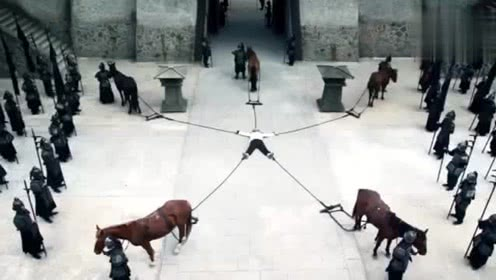
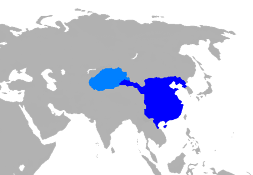
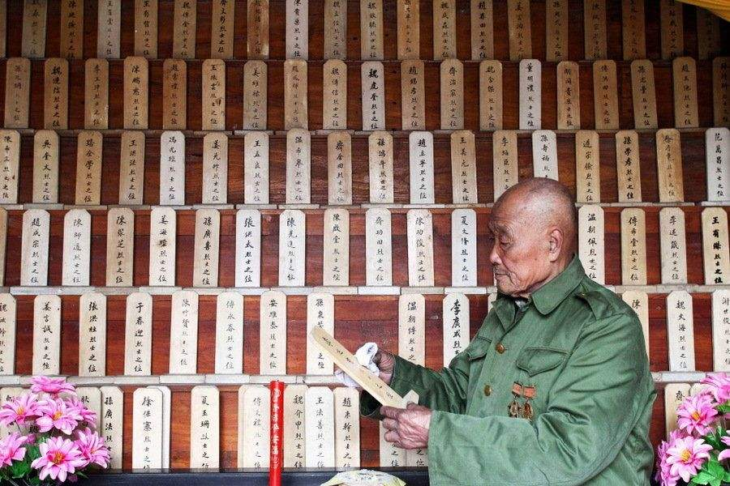
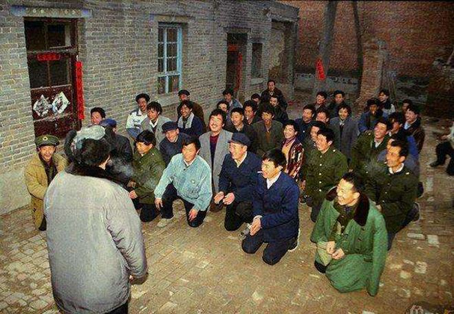

# Axial Age

>  **Axial  [ˈæksiəl]  Age** (also **Axis Age**,[[1\]](https://en.wikipedia.org/wiki/Axial_Age#cite_note-1) from [German](https://en.wikipedia.org/wiki/German_language): *Achsenzeit*) is a term coined by [German](https://en.wikipedia.org/wiki/Germany) [philosopher](https://en.wikipedia.org/wiki/Philosopher) [Karl Jaspers](https://en.wikipedia.org/wiki/Karl_Jaspers) in the sense of a "pivotal age" characterizing the period of [ancient history](https://en.wikipedia.org/wiki/Ancient_history) from about the 8th to the 3rd century BCE. - wikipedia

During this period, new ways of thinking appeared in Persia, India, China, and the Greco-Roman world in religion and philosophy, in striking parallel development. In this period, India produced Buddha, Greece produced Plato ['pleɪtoʊ], and China produced many schools of thought, including Taoism, Confucianism [kən'fju:ʃənɪzm] , Legalism. These three schools of thought have a profound influence on the ways Chinese people thinking. Espically, the Confucianism and Taoism.

# Confucianism

The creator of Confucianism is Confucius, lived from 551 B.C. to 479 B.C, he was a teacher and has so many well-known saying, like "A wise man will not fancy he knows what he does not know.", "Make no social distinctions in Teaching" and "Teach students in accordance with their aptitude".

But what make him so well-known not just because he came up with so many well-known sayings, but also because he create the Confucianism.

## Confucius's moral system

Because Confucius lived at a warring age, he saw many human tragedies caused by war, so he thought we should love each other, he said **we should expand the respect of the aged in one's family to that of other families; expand the love of the young ones in one's family to that of other families**.

This theory is derived from family, or rather **filial  [ˈfɪliəl] piety [ˈpaɪɪti]**. If we love my relatives, why we can't love strangers. If everyone thinks so, the world will be very beautiful.

In Confucius's moral system, there three fundamental personalities, **Benevolence(humaneness)** 仁, **Righteousness**義, **Ritual**禮. 

In addition to the three above, there are other different  requirements for different people. First of all, I'm want to emphasize that, Confucianism has always serverd the rulers. So in the process of development, the meaning of Confucianism became more and more increasingly inclined to the ruler.

So for the ruler, Confucianism states that "To a state, the people are the most important thing. The state comes second. The ruler is the least important."

For the government officials, "Ruler is like your parents, you can't never betray him, even if he is very bad or not competent. But you can help him to become better". There is a very well-known saying in China, it is usually said by official to the ruler, "When a monarch wants his minister to die, he has to die". 

For the normal people, you have to be obedient to your father [əˈbi:diənt]. So that's in east asia, there are so many corporal [ˈkɔ:pərəl] punishment and so many propose a marriage by pointing to the stomach -- an old practice of marriage had been engaged to each other before they were born. 

## Why Confucianism can be the mainstream ideology?

### Han dynasty

The Qin Shi Huang, we said in last blog, his empire just last two generation, including him. The reason why the empire collased so rapidly is that the empire adopt the **Legalism**. Legalism is not so flexible, so like if there is a team on thier way to build Great Wall will be beheaded when it rains and the date is delayed. The man who led the legal reform, Shang Yang, was later divied into five parts. Because the legal reform affected a large proportion of vested interests.

So the Han dynasty, think **Legalism** may be not the right option, we should use more peaceful manner to manage the cuntry. So Han Dynasty becomes a very huge empire.

However Han just utilized part of the meaning of Confucianism, and didn't revised the meaning too much. But the next several empires in China, had done so many changes to meet thier needs.

## The influence of Confucianism on Chinese ideology

### Science

### Creativity

### Patriarchal clan

#### Memorial tablet

#### New Year

#### Fujian earth building

The two figures below is Fujian, a province in south of China, earth building.

### Against Elder

 

