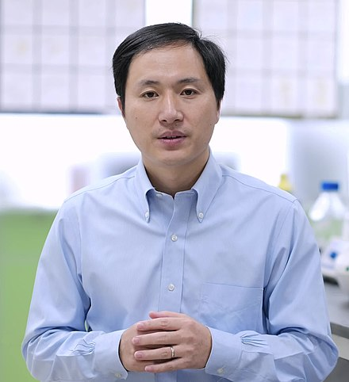
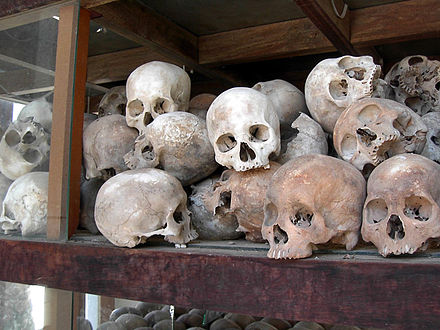
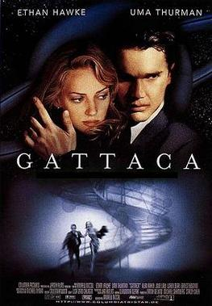
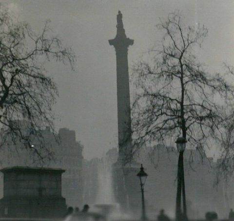
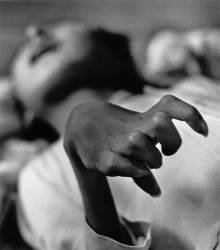

# China Gene-Edited Babies

I believe you have heard the news that gene-editied babies in China. The scientist Jiankui He created the first gene-edited babies, twine girls whose DNA had been edited to protect them from HIV.

The guy in the figure below is Jiankui He, it is a promising scientist just 35 years old. He can have profound contribution to the gene-edited area exclude the human, but he chose to open the Pandora box.

I'm very happy to embrace the technology and glad to see that the science progress. However, personally I'm very cautious about the technology, like the gene-edited human.

## It Break the "eternal" equality

> Rousseau sees the cause of the misfortunes of the human race in private property.

My attitube towards to the money is mild, I'm not like the Chairman Mao who has a strong will to eliminate the asset inequality. Just we have aggreement that compitition is good for the society progress.

The figure below is the skulls of Khmer Rouge victims, Khmer Rouge resolutely implements the equality of socialism and ignores the reality.

Well, for now, rich people can have easier life than poor people. Rich person can buy the luxurious clothes or supercars. However, they are still human, they can die, they have the same life span as poor person. They have same 24 hours one day.

But gene-edit break this law, rich person will become more and more like gods living on Mount Olympus. They can have good-looking, perfect body or high intelligence quotient. Gene-edit may divide the human into two species.

## Movie `Gattaca`

> The film presents a [biopunk](https://en.wikipedia.org/wiki/Biopunk) vision of a future society driven by [eugenics](https://en.wikipedia.org/wiki/Eugenics) where potential children are conceived through genetic selection to ensure they possess the best hereditary traits of their parents.
>
> The film's title is based on the letters G, A, T, and C, which stand for [guanine](https://en.wikipedia.org/wiki/Guanine), [adenine](https://en.wikipedia.org/wiki/Adenine), [thymine](https://en.wikipedia.org/wiki/Thymine), and [cytosine](https://en.wikipedia.org/wiki/Cytosine), the four [nucleobases](https://en.wikipedia.org/wiki/Nucleobase) of [DNA](https://en.wikipedia.org/wiki/DNA).

## Ethical issues

This topic is beyond my knowledge, so skip it.

## The babies

The gene-editied babies may reruns `The Truman Show`, the babies will draw continuous attention from all over the world. Their children may face same problem. It is cruel to the babies.

# The issues arised in the development of China

The gene-edit event does not exist in isolation, it reveal that there still same issues arised in the China rapid development. I will not condemn it, because most developed countries have same issues during there development, like the  **Great Smog of London**, **Enclosure Movement** and **Japan minamata disease events**. These events are all caused by the development of industry.

The figure below is the Nelson's Column during the Great Smog. 

The figure below is the hand of Tomoko Urmura, a Minamata disease victim.

However, I do not intend to justify the problem that have arisen in China. But I want to emphasize that there are so many think that the developed countries have had issues arised in the rapid development, so it is reasonable that China has same issues.

When I was in high school, the setenct **"pollution first, then treatment"** on the book. So you can imagine the thoughts of most Chinese about these issues.

## Internet privicy

## Copycat

## Corruption of grass-roots officials