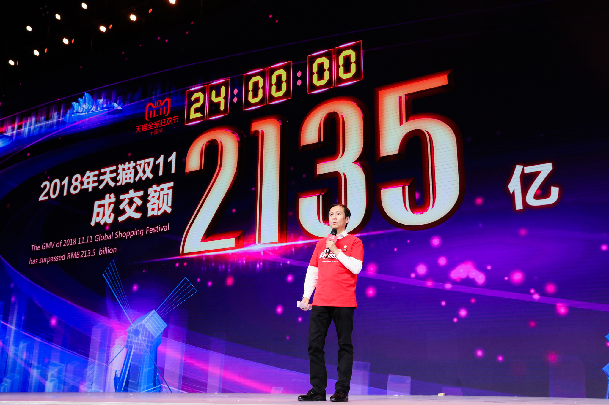

# China Gene-Edited Babies

I believe you have heard the news that gene-edited babies in China. The scientist Jiankui He created the first gene-edited babies, twine girls whose DNA had been edited to protect them from HIV.

The guy in the figure below is Jiankui He, it is a promising scientist just 35 years old. He can have a profound contribution to the gene-edited area, excluding the human, but he chose to open the Pandora box.

I'm very happy to embrace technology and glad to see that the scientific progress. However, personally, I'm very cautious about technology, like the gene-edited human.

## It Break the "eternal[ɪˈtɜ:rnl]" equality

> Rousseau [ruˈso]  sees the cause of the misfortunes of the human race in private property.

My attitude towards the money is mild, I'm not like Chairman Mao who has a strong will to eliminate the asset inequality. Just we have the agreement that competition is good for social progress.

The figure below is the skulls [skʌl]  of Khmer [kmer] Rouge [ruʒ] victims, Khmer Rouge resolutely [ˈrɛzəˌlutlɪ] implements the equality of socialism and ignores the reality.

Well, for now, rich people can have an easier life than poor people. A rich person can buy luxurious[lʌgˈʒʊriəs] clothes or supercars. However, they are still human, they can die, they have the same life span as a poor person. They have the same 24 hours one day.

But gene-edit break this law, the rich person will become more and more like gods living on Mount Olympus. They can have a good-looking, perfect body or high intelligence quotient. Gene-edit may divide the human into two species.

## Movie `Gattaca`

> The film presents a [biopunk](https://en.wikipedia.org/wiki/Biopunk) vision of a future society driven by [eugenics](https://en.wikipedia.org/wiki/Eugenics) where potential children are conceived through genetic selection to ensure they possess[pəˈzɛs]  the best hereditary[həˈredɪteri] traits of their parents.
>
> The film's title is based on the letters G, A, T, and C, which stand for [guanine](https://en.wikipedia.org/wiki/Guanine), [adenine](https://en.wikipedia.org/wiki/Adenine), [thymine](https://en.wikipedia.org/wiki/Thymine), and [cytosine](https://en.wikipedia.org/wiki/Cytosine), the four [nucleobases](https://en.wikipedia.org/wiki/Nucleobase) of [DNA](https://en.wikipedia.org/wiki/DNA).

## Ethical [ˈɛθɪkəl]  issues

This topic is beyond my knowledge, so skip it.

## The babies

The gene-edited babies may reruns `The Truman Show`, the babies will draw continuous attention from all over the world in their growth process. Their children may face the same problem. It is cruel to these babies.

# The issues raised in the development of China

The gene-edit event does not exist in isolation, it reveals that there still some issues raised in China rapid development. I will not condemn [kənˈdɛm] it, because most developed countries have same issues during there development, like the  **Great Smog of London**, **Enclosure Movement** and **Japan minamata disease events**(A serious neurological[ˌnʊrəˈlɑ:dʒɪkl]  disease caused by mercury[ˈmɜ:rkjəri]  poisoning). These events are all caused by the development of the industry.

The figure below is the Nelson's Column during the Great Smog. 

The figure below is the hand of Tomoko Urmura, a Minamata disease victim.

However, I do not intend to justify the problem that hs arisen in China. But I want to emphasize that there are so many think that the developed countries have had issues raised in the rapid development, so it is reasonable that China has the same issues.

When I was in high school, the setenct **"pollution first, then treatment"** on the book. So you can imagine the thoughts of most Chinese about these issues.

## Internet privicy

To some extent, China has no Internet privacy. Although, China Internet industry has become an important part of the world. Can you believe that Chinese hardly use cash in daily life, I can travel all over the country without cash, just use my cellphone.

The development of the Internet industry is benefit from the Great Firewall. That's why Alibaba, Tencent, Baidu can become a powerful technology company in the world. But it is another story.

However, when it comes to Internet privacy, China is the worst country in the world. People don't care about their personal information, they click the agree button of privacy protocol subconscious. The main way of privacy disclosure is disclosure of the mail information. In the 2018.11.11, there are one billion pakcages posted in China. And people bought more than 21.35 billion RMB, roughly about 3 billon dollars on Alibaba.

I can imagine that how much personal information have been leaked through the mail bill. The other way that information leaked is that Company doesn't care about your personal information. Like when I search a book on my work computer in my office, when I come home and use personal laptop, I will see the book advertisement when I watch video. I have no idea how the apps can exchange my personal information.

And Chinese, espicially the old people, they can use their information to exchange the cheap goods. Maybe it is prejudice, in China, the people between 50 ~ 65 is the worst quality group, the lack of education in Cultral Revolution may be one of the reasons.

Increasingly, Internet users have realized that the imprortance of personal information. Apperantly, there is still a long way to go.

## Copycat

## Corruption of grass-roots officials