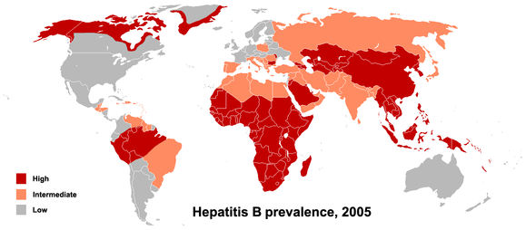

# 1.What is Hepatitis B?

> **Hepatitis B** is an [infectious disease](https://en.wikipedia.org/wiki/Infectious_disease) caused by the [hepatitis B virus](https://en.wikipedia.org/wiki/Hepatitis_B_virus) (HBV) that affects the [liver](https://en.wikipedia.org/wiki/Liver).[[1\]](https://en.wikipedia.org/wiki/Hepatitis_B#cite_note-WHO2014-1) It can cause both acute and [chronic infections](https://en.wikipedia.org/wiki/Chronic_infection).[[1\]](https://en.wikipedia.org/wiki/Hepatitis_B#cite_note-WHO2014-1)Many people have no symptoms during the initial infection.

> As of 2010, China has 120 million infected people, followed by India and Indonesia with 40 million and 12 million, respectively. 

# 2.The causes

## Education

They have no basic medical knowlege.

### AIDS Village

Use same needle for thousands of people. China has 38 AIDS villages.

## Technology

China is incapable of doing the research on the HBV. Yea, the cultural revolution hindered China's development for at least ten years.

## Poverty

For the typical family of China, they have no money for the vaccination. And the parents have no idea to do the pre-pregnancy physical examination。

## The imbalance between male and female

Male have the lower chance to find the female, so they will hide the fact that they have HBV.

## Family planning

The pregnant woman have to run away from home to avoid forced abortion. That means when the child born, they have no basic medical examination and miss the very time for vaccination[ˌvæksəˈneʃən].

# 3.A greate P. Roy Vagelos

## Vaccine  [vækˈsi:n]

> At first we wanted to sell the hepatitis B vaccine to China. However, after realizing that even if we reduced the pricing to the lowest possible, China still could not afford it. In the United States, the vaccine has to be injected three times within six months at the cost of US$100, which is most affordable to American families but to the average Chinese family, this is equivalent to their income for half a year.
>
> In view of this, we started to discuss a technology transfer. We repeatedly reduced the price, yet China still could not afford it. I was very anxious and time was pressing. I wanted to protect all the children in China against this deadly disease. All newborns have to be vaccinated within 24 hours of birth. Finally, I proposed US$7 million to transfer the technology to China.”

In September 1989, Merck signed an agreement with China to transfer the hepatitis B vaccine technology. Merck provided China with a full set of technology and equipment for the production of the hepatitis B vaccine and to train Chinese personnel to ensure the same quality of vaccine that was made in the U.S. could be produced in the factories in China.

# 4.Family Planning

For now, male is 37 million more than female in China. In contrast, the population of Canada is 36.71 million in 2017.