# What is Chinese Spring Festival(Chinese New Year)

## The origin

Like other festivals, there is no exact time of origin of the Chinese Spring Festival. Mainly it is originates from primitive beliefs and the sacrifices to ancestors. Not like West, most of the festivals is originate from the religion, like the Christmas and the St. Patrick's Day. 

When it comes to Chinese New Year, we can't ignore the Lunar calendar(Lunar calendar decide the exact date of the Chinese New Year.) and the transport during the Chinese New Year.

## Celebration activities

### Fireworks and Firecrackers

IIRC, fireworks are possibly invented by Chinese. Almost every family will celebrate the New year with the fireworks and firecrackers. However, air pollution is very serious in China. In earlier times, people are too poor to buy the fireworks, so it do not have a notable impact on the air.

In the figure below, we can see that the pollution brought by firecrackers. So in recent days, China cities are do not allow the fireworks in the urban area.

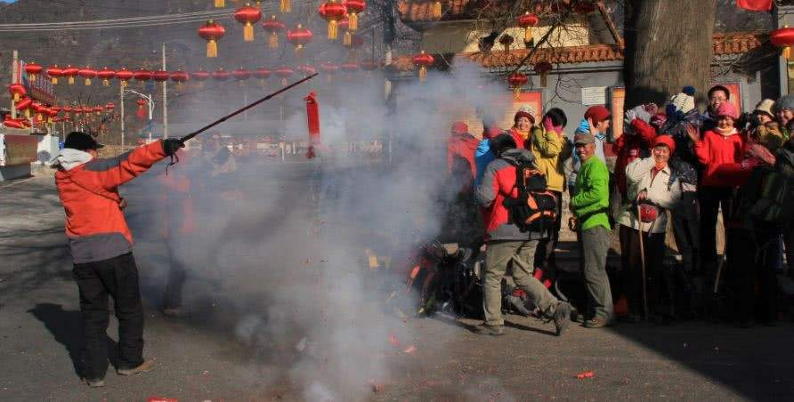

### Couplets ['kʌplɪts] 

In the figure below, we can see there are Chinese characters on both sides of the door. It originated from ancient Chinese poetry, the couplets have to follow certain rules, it is very complicated.

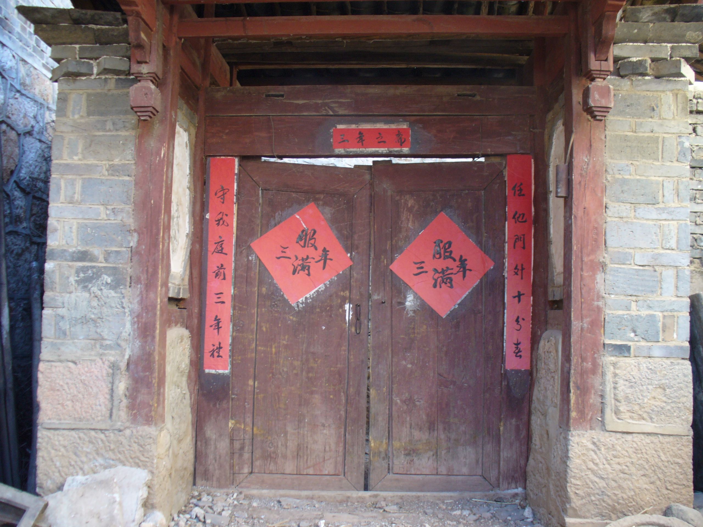

### Door-god (Menshen)

Door-god is a very beautiful and imaginative portrait, people stick them on the door to drive away the demons and ghosts. So people believe Menshen can protect them from bad things.

The door-god are almost the famous general or mages. But there is no standard or rules for that, if you want, you can put Caesar or Eisenhower['aɪzənˌhaʊər]  on the door.

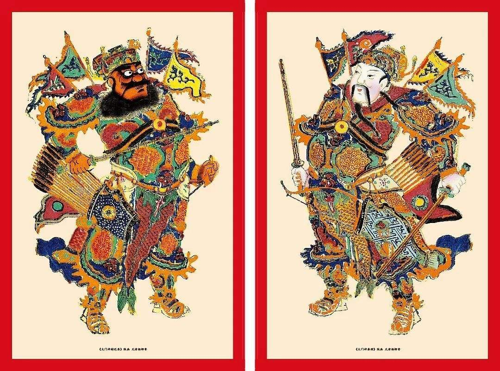

It is more like the facial makeup in Beijing opera, they can create infinite artistic effects.

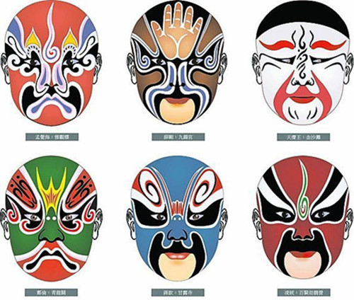

### Paper-cuts on window

Chinese paper cutting is another art form. It is a very old traditional art, you can create infinite shapes through scissors [ˈsɪzərz]  and paper. But it is very difficult and there are fewer and fewer people engaged in this art. 

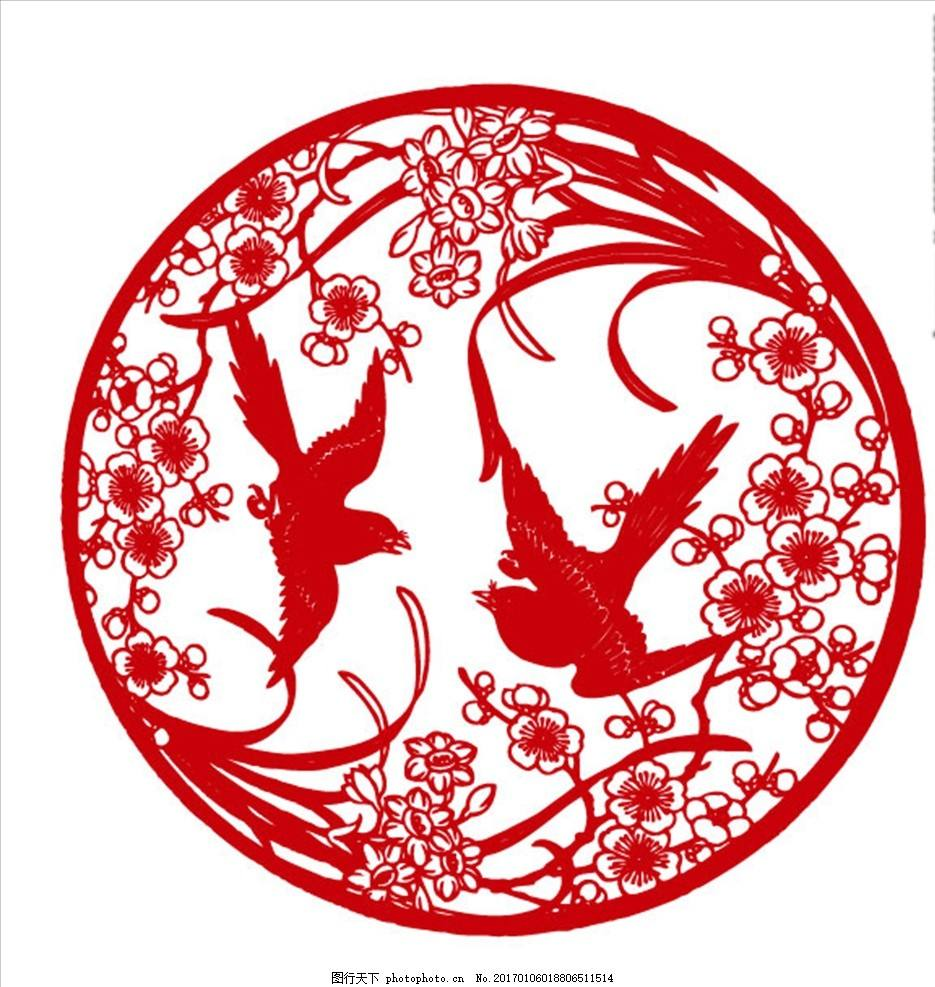

### Lantern

Lantern is another decoration in Chinese New Year. 

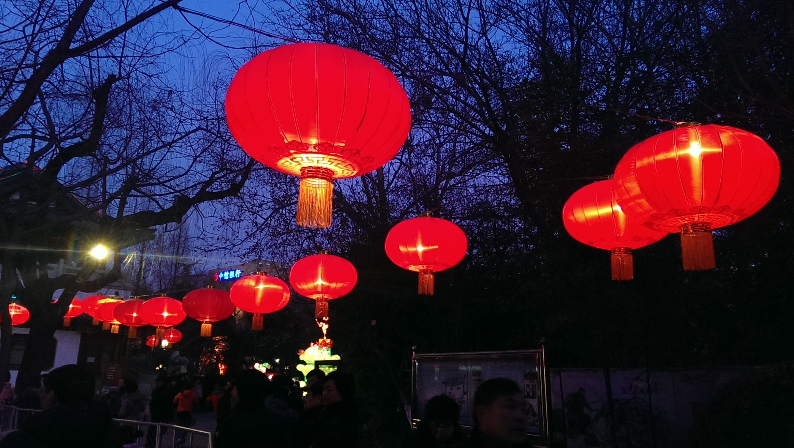

## Lunar calendar

> A **lunar calendar** is a [calendar](https://en.wikipedia.org/wiki/Calendar) based upon the [monthly](https://en.wikipedia.org/wiki/Month) cycles of the [Moon](https://en.wikipedia.org/wiki/Moon)'s [phases](https://en.wikipedia.org/wiki/Lunar_phase) ([synodic months](https://en.wikipedia.org/wiki/Lunar_month#Synodic_month)), in contrast to [solar calendars](https://en.wikipedia.org/wiki/Solar_calendar), whose annual cycles are based only directly upon the [solar year](https://en.wikipedia.org/wiki/Solar_year). -wikipedia

The Lunar calendar is very popular in Asia area, like Korean, Japan, Vietnam, and Mongolia. Since the Gregorian calendar is the most popular calendar in the world, so Lunar calendar bring a little inconvenience in real life but it also brings the traditional cultural atmosphere.

### Chang'e

Chang'e is the goddess of the moon and she is the subject of several legends in Chinese mythology [mɪˈθɑ:lədʒi]. We think there is a palace on the moon and only Chang'e  in this desolate[ˈdɛsəlɪt] place with a white rabbit.

Below is the conversation between Houston[ˈhjustən] and Apollo 11 crew just before the first Moon landing in 1969.

> **Ronald Evans (CC)**: Among the large headlines concerning Apollo this morning, is one asking that you watch for a lovely girl with a big rabbit. An ancient legend says a beautiful Chinese girl called Chang-O has been living there for 4,000 years. It seems she was banished to the Moon because she stole the pill of immortality from her husband. You might also look for her companion [kəmˈpænjən], a large [Chinese rabbit](https://en.wikipedia.org/wiki/Moon_rabbit), who is easy to spot since he is always standing on his hind  [haɪnd]  feet in the shade of a cinnamon[ˈsɪnəmən] tree. The name of the rabbit is not reported.

China has launched many satellites[ˈsætəlaɪt] around the moon, they all have names prefixed with Chang'e. The interesting part is that China has also launched several Lunar rovers, they all have names prefixed with rabbit. 

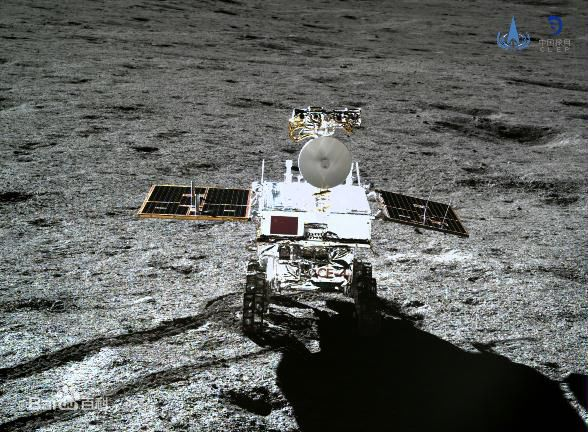

## Transport during the Spring Festival (Chunyun)

This Spring Festival travel is a period of travel in China with extremely high traffic load around the time of the Chinese New Year. It has been called the largest annual human migration in the world.

>  The number of passenger-journeys during the Chunyun period is projected to be hitting over 2.9 billion in 2016.

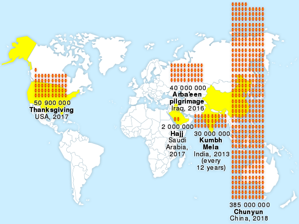

# What is Chinese Zodiac

> The Chinese Zodiac is classification shceme that assigns an animal ant its reputed attributes to each year in a repeating 12-year cycle.

The Chinese Zodiac may not originate from China, it may be from India or the Middle East. However, the Korea Zodiac, Vietnamese Zodiac, and  Japanese Zodiac are from China.

## The bronze Zodiac in Yuanmingyuan(Old Summer Palace)

Recent years, when it comes to Chinese Zodiac, I have to mention the bronze Zodiac in Yuanmingyuan. Chinese have very complex feelings about the bronze Zodiac in Yuanmingyuan. Because they were stolen in the Second Opium[ˈəʊpiəm]  War.

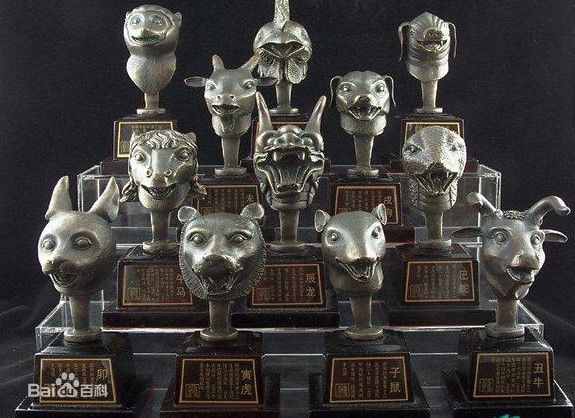

Actually, they don't have so much artistic value, because they were designed by foreign missionary in 1759. The reason why they are so important to Chinese is that they are typical Chinese cultural relics, i.e. they are Chinese Zodiac, stolen by the soldiers of the Victory.

> Two robbers breaking into a museum. One has looted, the other has burnt. ... one of the two conquerors filled its pockets, seing that, the other filled its safes; and they came back to Europe laughing hand-in-hand. ... Before history, one of the bandits will be called France and the other England. - [Victor Hugo](https://en.wikipedia.org/wiki/Victor_Hugo) 

When the bronze Zodiac first appeared after World War II, three of them just sold 1500$ in 1985. However, in 2009, the bronze rabbit auctioned 14 million Euro. The sellers think Chinese have to get it. If it is the bronze dragon, I'm afraid the final price will exceed 100 million.

For now, the bronze snake, bronze sheep, bronze chicken, and bronze dog are still missing.

With China more powerful, Chinese always want to take back what we lost. I think these thoughs are all right, but in my mind we should be better be moderate. Like the Germany after World War I, the emotions about restore glory are possibly used by the dangerous man.

The typical example about these emotions is the Chinese law about narcotics [nɑ:'kɒtɪks]  .

### Chinese law about narcotics

If you sell the more than 50 grams of drugs, you will sentenced to death in China. The main reason behind this is that Chinese think drugs are a humiliation [hjuˌmɪliˈeʃən] to Chinese.  About 100 years ago, Britian opened the door to China with guns and opium. For a long time, Chinese and opium are bound together in the Western impression.

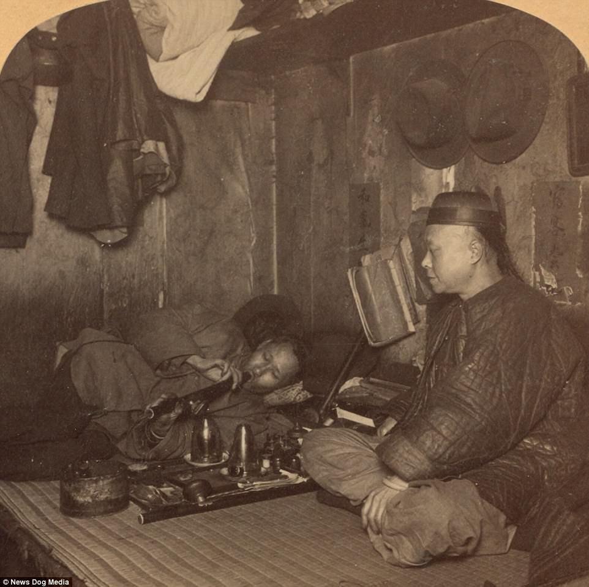

Few days ago, China sentences a Canadian to death for drugs smuggling. China can negotiate for all things except for the drugs.

In 2009, a Chinese Heroin maker and seller, Liu Zhaohua, are executed to death punishment. But this guy are considered a hero by most Chinese, because he said, "I never sell drugs to Chinese, the drugs are all sold to foreigners. They once used opium opened the door to China, I want to use Heroin to open the door to foreign country."

You see, Chinese never forget the hurts on Chinese. But this national sentiment could  become very scary. 

I could say China is luckier than India and Ottoman Turkey, in 19th century there were ancient countries destroyed by emerging forces. 

The figure below is the area of Ottoman Turkey in 1795.

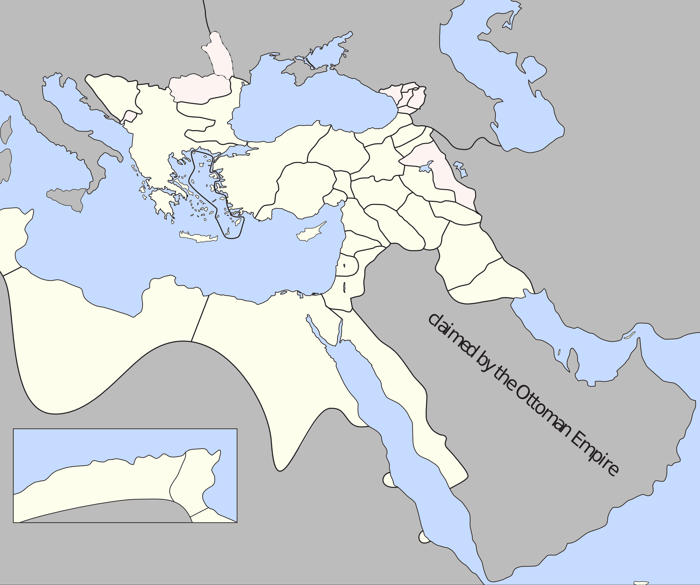

But I have to say China and Ottoman Turkey onced play the role of aggressors.

### Cultural Relic

China has so many relics lost overseas, they are almost lost between 19th century and 20th century. They were sold by greedy businessman, stolen by foregin explorers, robbed by foreign soldiers. The reasons for that is complicated, we can't just blame the outsider.

### Cultural Revolution

You may probly know the Chinese Cultural Revolution, the simple reason is that the governer think feudal antiquity is the cause of China's backwardness. So we blindly destoyed all cultural relics, the relics lost overseas survived.

The cultural relics destroy are still happening in Afghanistan and Syria.

In the figure below, ISIS are destroying the relics.

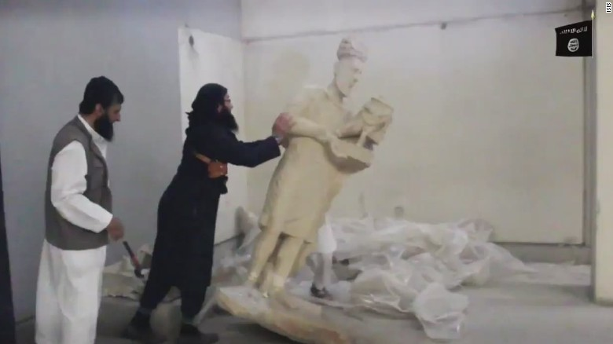

### Should museums return Cultural relics?

There is no answer for the question that should museums return Cultural relics. For me, because I'm Chinese, so I think the museum should return back. China now has the money and technology to protect these tresures.

#### Egyptian Obelisk

The most well-known Obelisk is the one at [Saint Peter's Square](https://en.wikipedia.org/wiki/Saint_Peter%27s_Square) in Rome. It was stolen in ancient Rome.

#### code of Hammurabi

#### The Metropolitan Museum of Art

#### The Chinese Cultural Relic lost abroad.

### Confidence in Chinese Culture

中国近些年来非常强调文化自信，但是这些文化自信并不是依靠古老的东西，而是现在的成就。

没有办法

