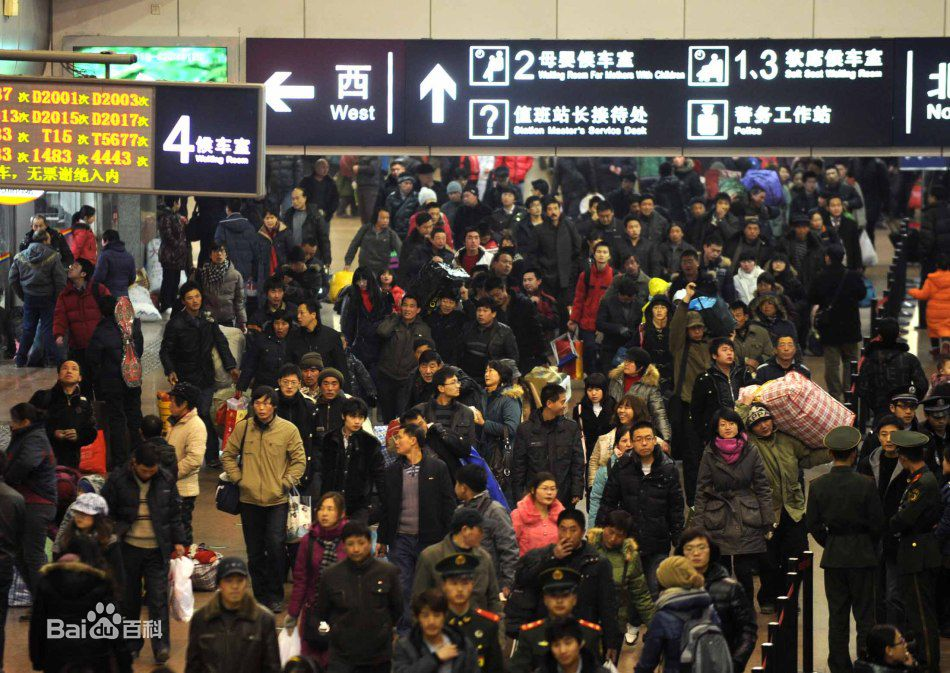

# What is Chinese Spring Festival(Chinese New Year)

## The origin

Like other festivals, there is no exact time of origin of the Chinese Spring Festival. Mainly it is originates from primitive beliefs and the sacrifices to ancestors. Not like West, most of the festivals is originate from the religion, like the Christmas and the St. Patrick's Day. 

When it comes to Chinese New Year, we can't ignore the Lunar calendar(Lunar calendar decide the exact date of the Chinese New Year.) and the transport during the Chinese New Year.

## Celebration activities

### Fireworks and Firecrackers

IIRC, fireworks are possibly invented by Chinese. Almost every family will celebrate the New year with the fireworks and firecrackers. However, air pollution is very serious in China. In earlier times, people are too poor to buy the fireworks, so it do not have a notable impact on the air.

In the figure below, we can see that the pollution brought by firecrackers. So in recent days, China cities are do not allow the fireworks in the urban area.

### Couplets ['kʌplɪts] 

In the figure below, we can see there are Chinese characters on both sides of the door. It originated from ancient Chinese poetry, the couplets have to follow certain rules, it is very complicated.

### Door-god (Menshen)

Door-god is a very beautiful and imaginative portrait, people stick them on the door to drive away the demons and ghosts. So people believe Menshen can protect them from bad things.

The door-god are almost the famous general or mages. But there is no standard or rules for that, if you want, you can put Caesar or Eisenhower['aɪzənˌhaʊər]  on the door.

It is more like the facial makeup in Beijing opera, they can create infinite artistic effects.

### Paper-cuts on window

Chinese paper cutting is another art form. It is a very old traditional art, you can create infinite shapes through scissors [ˈsɪzərz]  and paper. But it is very difficult and there are fewer and fewer people engaged in this art. 

### Lantern

Lantern is another decoration in Chinese New Year. 

## Lunar calendar

> A **lunar calendar** is a [calendar](https://en.wikipedia.org/wiki/Calendar) based upon the [monthly](https://en.wikipedia.org/wiki/Month) cycles of the [Moon](https://en.wikipedia.org/wiki/Moon)'s [phases](https://en.wikipedia.org/wiki/Lunar_phase) ([synodic months](https://en.wikipedia.org/wiki/Lunar_month#Synodic_month)), in contrast to [solar calendars](https://en.wikipedia.org/wiki/Solar_calendar), whose annual cycles are based only directly upon the [solar year](https://en.wikipedia.org/wiki/Solar_year). -wikipedia

The Lunar calendar is very popular in Asia area, like Korean, Japan, Vietnam, and Mongolia. Since the Gregorian calendar is the most popular calendar in the world, so Lunar calendar bring a little inconvenience in real life but it also brings the traditional cultural atmosphere.

### Chang'e

Chang'e is the goddess of the moon and she is the subject of several legends in Chinese mythology [mɪˈθɑ:lədʒi]. We think there is a palace on the moon and only Chang'e  in this desolate[ˈdɛsəlɪt] place with a white rabbit.

Below is the conversation between Houston[ˈhjustən] and Apollo 11 crew just before the first Moon landing in 1969.

> **Ronald Evans (CC)**: Among the large headlines concerning Apollo this morning, is one asking that you watch for a lovely girl with a big rabbit. An ancient legend says a beautiful Chinese girl called Chang-O has been living there for 4,000 years. It seems she was banished to the Moon because she stole the pill of immortality from her husband. You might also look for her companion [kəmˈpænjən], a large [Chinese rabbit](https://en.wikipedia.org/wiki/Moon_rabbit), who is easy to spot since he is always standing on his hind  [haɪnd]  feet in the shade of a cinnamon[ˈsɪnəmən] tree. The name of the rabbit is not reported.

China has launched many satellites[ˈsætəlaɪt] around the moon, they all have names prefixed with Chang'e. The interesting part is that China has also launched several Lunar rovers, they all have names prefixed with rabbit. 

## Transport during the Spring Festival (Chunyun)

This Spring Festival travel is a period of travel in China with extremely high traffic load around the time of the Chinese New Year. It has been called the largest annual human migration in the world.

>  The number of passenger-journeys during the Chunyun period is projected to be hitting over 2.9 billion in 2016.

# What is Chinese Zodiac

## The origin

## Zodiac in other countries

