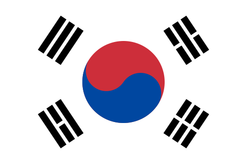
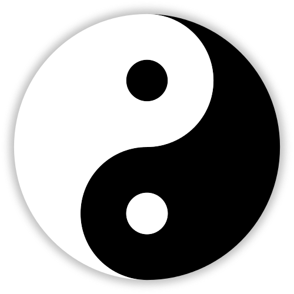
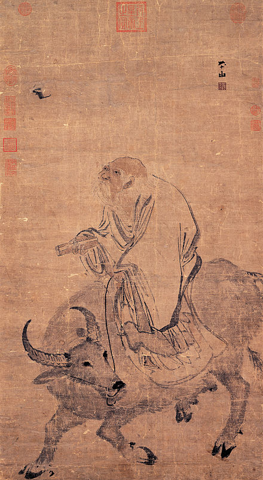

# Taoism

## 1.The interesting things about the Taoism

### [1.1 Flag of the South Of Korea](https://en.wikipedia.org/wiki/Flag_of_South_Korea)

The flag of the South of Korea is formed by the elements from Taoism.

The kernel is a redesigned Taiji graph, the original Taiji is like the figure below. The white and black part are Yin and Yang.

### 1.2 Be water, my friend - Bruce Lee

Has you watched the video about the Bruce Lee "Be water, my friend"? You can click this link to watch the video https://www.youtube.com/watch?v=cJMwBwFj5nQ. =

Bruce Lee profoundly reveals the impact of water on Chinese people. Water are always make a concession[kənˈsɛʃən]  , water is very flexible, it never against the hard things.

- **Water is formless, therefore it can adapt to every form.**
- **You, however, are often way too rigid [ˈrɪdʒɪd].**
- **You do not adapt.**
- **Stop trying to make the teacup adjust to you and adjust to the teacup instead.**

Like the Chinese will never show a tough side, they think we should be like water, to influence the environment in a subtle way. **To a certain extent, it suppresses the idea of Chinese resistance**.

### 1.3 The differences between the Taoism and Confucianism

To be a civilized man, or to be a natural man? The Confucianism says we should be a civilized man, but the Taoism says we should be a natual man. Propriety[prəˈpraɪɪti] is all a matter of appearance, which we should leave behind to discover something more essential.

There is a famous story to reveal the differences between Taoism and Confucianism. If we see a tiger hunting a sheep, for Confucianism, man should be kind, although it is not because the tigers are morally corrupt that they eat sheep, however we should save this sheep at least. 

For Taoism, we should not interfere the hunting, because if we save sheep, the tiger will be starved. We should respect thenature law.

## 2.The Origin

Like Conficianiam, Taoism is created at Axial Age. The creator is Laozi. And the Taoism is for the ruler in the very beginning.

## 3.The meanings

There are so many famous sayings in Taoism, as I said before, Taoism is for the ruler, I may have inaccurate understandings about the Taoism. So in this blog, I will put part of the sayings and try to use my words to describe what they are meaning.

### 3.1 Objective law

Taoism think the world has the obective law, we should respect it and use it to guide our behavior. If you try to fight against it, you will inevitably [ɪnˈevɪtəbli]  fail. 

There are some objective laws are clear to us, like we all know the perpetual [pərˈpetʃuəl] motion machine is impossible. However there are other laws we can't recognize them quickly.

Like the diploma  [dɪˈploʊmə], in China universities, there are part of students try to cheat on the examination, however when they can get the diploma, they may think they have master the relevant knowledge. But what really represents competence is not the diploma, but the knowledge behind it.

There so many things that we should not rely on, like reputation, like pray to the God, pray to the forefathers, they can't help you, right? What do really help you are  the courage and confidence behind the gods.

Taoism tell us we should look through the appearance, and get the truth. In Taoism, they are very **fond of ** discussing the relationship between the name and enttiy.

### 3.2 Govern by doing nothing that goes against nature

That not means Taoism does not respect the **subjective initiative**. But we are required to act under objective laws.

### 3.3 Three realms

There is a Chinese novel come up with the three realms when we learn Taoism.

#### 3.3 Moon in well

Well is your heart, moon is the reality. "Moon in well" mainly tell people you have to accept the world as it is. The world won't let tigers stop killing because just you like sheep. 

Taoism believes that you should have a ruthless view of the world, which is a necessary ability of a ruler. The ruler can't be biased or indecisive [ˌɪndɪˈsaɪsɪv]  . It's possible that you have to sacrifice one person to save more people.

#### 3.4 One can be austere [ɔ:ˈstɪr] if he has no selfish desires

## 4.The influence

太绝对，会走极端

